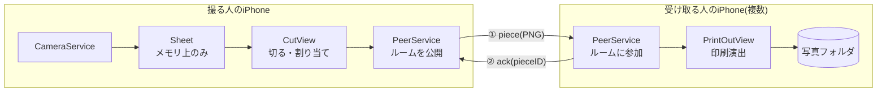

# わけプリ(仮) 技術設計書 v1

要件: [requirements-v1.md](./requirements-v1.md)

## 技術スタック
| 領域 | 採用技術 | 選定理由(1行) |
|---|---|---|
| 言語 / UI | Swift 5 モード + SwiftUI (iOS 17以上) | iPhone専用なら公式の定番。`@Observable` が使え状態管理が単純になる |
| プロジェクト生成 | XcodeGen (`project.yml`) | 設定をテキストで管理でき、Xcodeの複雑な設定画面を触る量を最小にできる |
| カメラ | AVFoundation (`AVCaptureSession` + `AVCapturePhotoOutput`) | カウントダウン連写と「写真フォルダに保存しない」を実現できる標準API |
| 端末間通信 | MultipeerConnectivity | Wi-Fi/Bluetoothで近くのiPhoneと直接つながる公式API。サーバー不要 |
| 写真保存 | Photos (`PHPhotoLibrary`、追加のみ権限) | 受け取った紙片を写真フォルダへ。読み取り権限は不要 |
| 印刷演出 | SwiftUIアニメーション + Core Haptics + AVAudioPlayer | すべて標準。外部ライブラリなし |
| テスト | XCTest(切断ロジックのみ) | 幾何計算は手で確かめにくいので自動テストで守る |
| サーバー / DB | なし | 要件で「サーバーに保存しない」と決めたため |

外部ライブラリは使わない(すべてApple標準フレームワーク)。

## システム構成



### データの流れ
1. **撮影**: 撮る人(ホスト)がアプリ内カメラで4枚撮影 → 2×2に並べた1枚のシート画像をメモリ上に作る。ディスクにも写真フォルダにも書かない。
2. **ルーム**: ホストが切る画面に入るとルームを公開する。近くの人は「受け取る」画面に表示されたルーム名(例:「あやのプリ」)をタップして参加。参加者がホスト画面下部のメンバー欄に並ぶ。
3. **切る・割り当て**: ホストが紙片を切ってメンバーへドラッグ。
4. **配る**: 割り当て済みの紙片を、切った形で透過PNGにして各相手へ送信 (①)。
5. **受け取り確認**: 受け取った側は届いたことを返信 (②)。ホストは確認を受け取った紙片だけをメモリから消す。10秒以内に確認が来なければ失敗扱いにして手元に戻す。
6. **印刷演出**: 受け取った側で紙片が上から出てくる演出 → 写真フォルダへ保存。
7. **自分の分**: 配り終えたら、誰にも割り当てなかった紙片はホスト自身の端末で同じ演出 → 写真フォルダへ保存。その後シート画像を破棄する。

## データモデル

すべてメモリ上の構造体。永続化するのは「写真フォルダに保存した最終PNG」だけ。

```swift
/// 撮影した1枚のシート
struct Sheet {
    let image: UIImage          // 4カットを2×2に合成した画像(長辺 約2000px)
    var pieces: [Piece]         // 最初は「シート全体」の1枚
}

/// 切った紙片
struct Piece: Identifiable {
    let id: UUID
    var polygon: [CGPoint]      // シート画像の座標系での多角形(凸多角形)
    var assignee: MCPeerID?     // 割り当て先。nil = 自分の分
    var status: Status          // .idle / .sending / .sent
    enum Status { case idle, sending, sent }
}

/// 端末間で送るメッセージ(バイナリPropertyListでエンコード)
enum PeerMessage: Codable {
    case piece(PieceTransfer)
    case ack(pieceID: UUID)
}

struct PieceTransfer: Codable {
    let pieceID: UUID
    let pngData: Data           // 切った形の透過PNG
    let senderName: String
}
```

関係: `Sheet` 1 — n `Piece`。`Piece` は 0..1 人の `MCPeerID`(メンバー)に割り当てられる。

### 切断のしくみ
- 指でなぞった始点と終点を結ぶ直線で、その線にかかるすべての紙片を2つに分ける。
- 紙片は常に凸多角形(長方形を直線で切ると必ず凸多角形になる)なので、「多角形を直線の左右で分ける」単純な計算で済む。
- 「1つ戻す」は `pieces` 配列の変更前の状態を履歴として積んでおき、取り出すだけ。

## 画面一覧

| 機能(要件) | 画面 | 概要 |
|---|---|---|
| 共通 | HomeView | 初回のニックネーム入力、「撮る」「受け取る」ボタン |
| 機能3: 撮影 | CameraView | 前面カメラ、3秒カウントダウン×4回、撮影後シートを表示して「切る」へ |
| 機能1: 切って配る | CutView | シート表示、なぞって切る、1つ戻す、下部にメンバー欄、紙片をメンバーへドラッグ、「配る」 |
| 機能1: 切って配る | CutView内の送信状態表示 | 送信中/完了/失敗を紙片ごとに表示 |
| 機能2: 印刷演出 | ReceiveView | 近くのルーム一覧 → 参加 → 「待機中…」表示 |
| 機能2: 印刷演出 | PrintOutView | 上から紙が出てくる演出 + 音 + 振動 → 写真フォルダ保存。受信側とホストの「自分の分」で共用 |

開発用: シミュレータにはカメラがないため、CameraView に「サンプル画像で作る」ボタンを `#if DEBUG` で用意する。

## ディレクトリ構成

```
project.yml                     # XcodeGenの設定(権限文言・Bonjour設定もここ)
WakePuri/
  WakePuriApp.swift
  AppState.swift                # 画面遷移とニックネーム
  Models/
    Sheet.swift
    Piece.swift
    PeerMessage.swift
  Services/
    CameraService.swift
    PeerService.swift           # MultipeerConnectivityのラッパー
    PhotoSaver.swift
    PrintFeedback.swift         # 振動と効果音
  Geometry/
    PolygonCutter.swift         # 多角形を直線で切る
    PieceRenderer.swift         # 多角形で切り抜いた透過PNGを作る
  Views/
    HomeView.swift
    CameraView.swift
    CutView.swift
    ReceiveView.swift
    PrintOutView.swift
  Resources/
    Assets.xcassets
    print.m4a                   # 印刷音(フリー素材を用意)
    SampleSheet.jpg             # シミュレータ用
WakePuriTests/
  PolygonCutterTests.swift
```

`Info.plist` に必要な設定(`project.yml` で生成):
- `NSCameraUsageDescription`
- `NSPhotoLibraryAddUsageDescription`
- `NSLocalNetworkUsageDescription`
- `NSBonjourServices`: `_wakepuri._tcp`, `_wakepuri._udp`

## 重要な設計判断(ADR)

### 判断1: 端末間通信は MultipeerConnectivity
- 決定: NFCではなく MultipeerConnectivity を使う。
- 理由: iPhone同士のNFC直接通信は一般アプリに開放されていない。MultipeerConnectivityならサーバーなしで近くの最大8台とつながる。
- 検討した代替案: NFCタグ経由(タグが必要で体験が悪い)、サーバー経由(要件外・開発量増)、Nearby Interaction(U1チップ搭載機のみ。距離は取れるがデータ送信は別途必要)。
- トレードオフ: 「端末を近づけたら渡る」ほどの近さ判定はできない。同じ部屋程度の範囲でルームに参加する形になる。

### 判断2: 参加はルーム方式(ホストが公開、参加者が選んで入る)
- 決定: 撮った人がルームを公開し、受け取る人が自分で選んで参加する。
- 理由: 近くの知らない人に勝手に表示・送信されるのを防げる。グループで「入った?」と声を掛け合うのも体験の一部になる。
- 検討した代替案: アプリを開いている近くの全員を自動表示(カフェ等で他人が混ざる)。
- トレードオフ: 参加の手間が1タップ増える。

### 判断3: 「渡したら消える」は受信確認(ack)後にメモリから消す
- 決定: シートも紙片もディスクに保存せずメモリ上だけで扱う。送信後、相手から受信確認が来た紙片だけを消す。
- 理由: 送れていないのに消える事故を防ぐ。ディスクに残さなければ「後から復元される」経路もない。
- 検討した代替案: 送信した瞬間に消す(通信失敗で紙片が消滅する)。
- トレードオフ: 配る前にアプリが落ちると撮った写真は失われる(v1では許容)。

### 判断4: 撮影枚数は4枚、2×2のシート
- 決定: 1回4枚、縦長シートに2×2で配置。
- 理由: プリクラで馴染みのある形で、切り分けやすい。2〜5人のグループで分けやすい枚数。
- 検討した代替案: 6枚(画面上で1カットが小さくなる)。
- トレードオフ: 後から変更しやすいよう、枚数とレイアウトは定数1か所にまとめる。

### 判断5: Xcodeプロジェクトは XcodeGen で生成
- 決定: `project.yml` から `xcodegen generate` でプロジェクトを作る。
- 理由: Claudeはこの環境でXcodeを操作できないため、設定をテキストで正確に渡せる方式にする。権限文言などの設定漏れも防げる。
- 検討した代替案: Xcodeの画面で新規作成してファイルを追加(手順が多く、設定ミスが起きやすい)。
- トレードオフ: Homebrew と XcodeGen のインストールが1回だけ必要。署名(Team)の設定はXcode上で1回行う。

## リスクと対策

| リスク | 対策 |
|---|---|
| Xcodeのインストールに時間がかかる(数十GB・数時間) | 今日のうちにApp StoreからXcodeをインストールしておく |
| iOS開発が初めてで、ビルドや署名でつまずく | 手順書を用意する。エラー文をそのまま貼ってもらえば対応する |
| シミュレータにカメラがない | DEBUG用のサンプル画像ボタンで、切る・配る・印刷演出をシミュレータでも確認できるようにする |
| 通信は実機でないと確かめにくい | 実機2台(本人+友達)で早めに一度通しで試す。無料アカウントでも友達のiPhoneをMacにケーブル接続すれば入れられる(7日で期限切れ) |
| 画像が大きく送信が遅い | シートの長辺を約2000pxに縮小。紙片PNGはそれ以下になる |
| 印刷音の素材 | フリー効果音サイトから利用規約を確認して1つ選ぶ。なくても振動だけで動くようにする |
| 来週という期限 | 優先順(切って配る → 印刷演出 → 撮影)で作り、撮影が間に合わなければサンプル画像で体験を確認する |

## v2以降への拡張ポイント(メモのみ・実装はしない)
- 曲線・手描きでの切り取り(多角形を一般の形に拡張)
- 落書き・スタンプ
- Nearby Interaction で「端末を近づけた人に渡す」演出
- 受け取ったものを紙片アルバムとしてアプリ内に並べる
- App Clip で、アプリなしでも受け取れるようにする
